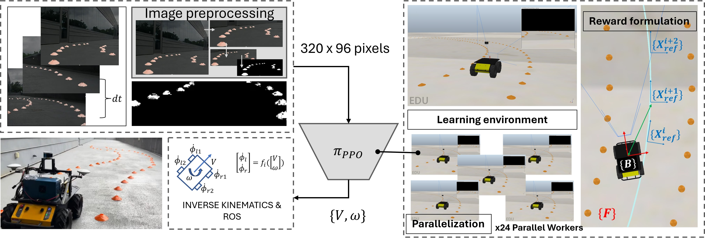
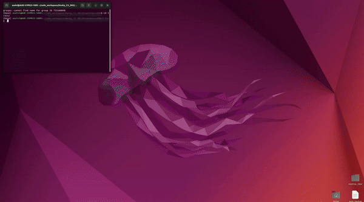

# Pose Enhanced Learning for Skid-steered visual navigation



## Installations
1. CoppeliaSim Robotics Simulator
- Downlodable at : https://coppeliarobotics.com/ 
- Ensure ZMQ package is installed for Python CoppeliaSim API (https://manual.coppeliarobotics.com/en/zmqRemoteApiOverview.htm) 

2. Clone the repository locally

3. Learning (StableBaselines3): Install the environment.yml file in your python environment. This installs SB3 with all the necessary python dependencies.

```
conda env update -f environment.yml
```

4. Register the learning environment such that SB3 identifies it as a python module. Environment packgaged as a python module in the folder : HuskyCP-gym

```
cd HuskyCP-gym/
pip install -e .
```

(pytorch versions may have to be updated as per user's Cuda requirements)


## Training and Evaluation

### Updating training variables

1. In the environment description file : 'HuskyCP-gym/huskyCP_gym/envs/huskyCP_gymPathFrenAW.py' update line 21 

```
sys.path.insert(0, "/home/asalvi/code_workspace/Husky_CS_SB3/train/") #Ensure correct path to your 'train' folder
```

2. In the environment description file : 'HuskyCP-gym/huskyCP_gym/envs/huskyCP_gymPathFrenAW.py' update line 105 to update local path to the folder MixPathFlip

```
path_loc = '/home/asalvi/code_workspace/Husky_CS_SB3/HuskyModels/MixPathFlip/'
```

3. In the training script 'train_parallel.py' Update lines 25 - 30
```
import sys
sys.path.insert(0, "/home/asalvi/code_workspace/Husky_CS_SB3/train/HuskyCP-gym") #Ensure correct path
import huskyCP_gym

tmp_path = "/home/asalvi/code_workspace/tmp/sb3_log/VisServo/test/" # Path to save logs
variant = 'test' # Save final model by this name

```

### Training and Saving

4. Launch parallel simulation instances (file : 'exec_loop.sh') (provided script launches 4 parallel instances. Can be scaled upto 50 (verified))
- Script ensures all instances are instantiated on different ports (CoppeliaSim requirement)
- Ensure sourcing correct location of CoppeliaSim installation directory

```
./exec_loop.sh
```
 

5. Once all instantces are launched, in another shell, run training script
```
python3 train_parallel.py
```


### Evaluation


## Implementation Details

### Course Generation


### Path parameterization